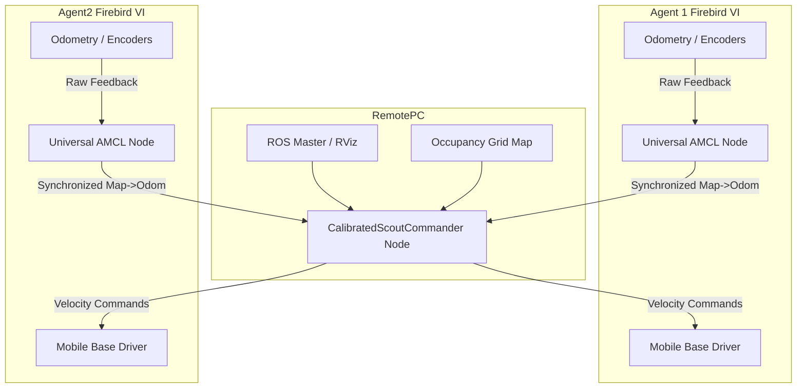

# Swarm Environment Monitoring Using Firebird VI Robots
[](http://wiki.ros.org/noetic)
[](https://www.nex-robotics.com/)
[](LICENSE)

An autonomous swarm robotics framework implemented on the **FireBird VI** research platform using **ROS 1 Noetic**. This repository contains the centralized fleet management system, coordinate synchronization modules, and the kinematic calibration algorithms developed to enable precise multi-agent formation patrolling and return-to-base missions.
---
## 📌 Project Overview
This project addresses key challenges in physical multi-agent coordination, bridging the gap between theoretical swarm models and real-world hardware deployment.
### Key Contributions
* **Centralized Fleet Architecture:** A Master-Slave topology coordinating multiple namespace-isolated agents (`/robot1`, `/robot2`, etc.) from a centralized Remote PC.
* **Coordinate Synchronization:** A custom `UniversalAMCL` bridge manually broadcasting the $Map \to Odom$ transforms to align all agents within a single global frame.
* **Systematic Calibration:** A mathematical correction model that resolves a **19.5% systematic rotation drift** observed in differential-drive hardware.
* **State-Machine Mission Control (`CalibratedScoutCommander`):** A robust three-state manager (`IDLE` ➔ `MISSION` ➔ `RETURN`) to command spatial tasks, execute precise circular orbits, and prevent long-term odometry wander.
---
## 🏗️ System Architecture
The swarm control is split hierarchically into two layers:
1. **Central Command Layer (Remote PC)**
   * Manages the primary ROS Master.
   * Runs the mapping engines (FastSLAM / Gmapping) and visualizes the collective state in RViz.
   * Dispatches waypoints and coordinates active missions.
2. **Agent Execution Layer (FireBird VI Robots)**
   * Runs onboard Intel NUCs for localized navigation, motor control, and sonar-based safety checks.
   * Receives high-level velocity commands (`cmd_vel`) and handles low-level hardware actuation.

---
## ⚙️ Hardware Calibration & Math
A core hurdle in physical deployment was a **19.5% mechanical over-rotation error** caused by minor wheel-encoder discrepancies. Without compensation, agents drift rapidly during orientation maneuvers.
### Correction Formula
To ensure precise orbital patrolling, the target angular displacement ($\theta$) is adjusted using the error ratio (error_ratio = $0.195$):

$$\theta_{cal} = \frac{2\pi}{1 + error_ratio} \approx 301.26^\circ$$

Integrating this compensation into the command loop allows robots to perform a precise $360^\circ$ physical rotation when a circular orbit is commanded.
---
## 🔄 Mission Workflow
The `CalibratedScoutCommander` handles agent operations through a centralized sequential state machine:
```
 ┌──────────────┐      Goal Dispatched      ┌────────────────┐
 │     IDLE     ├──────────────────────────>│    MISSION     │
 └──────▲───────┘                           └──────┬─────────┘
        │                                          │
        │ Mission Finished                         │ Orbit Completed
        │ & Substation Arrival                     │ & Calibration Check
        │                                          ▼
 ┌──────┴───────┐                           ┌────────────────┐
 │  IDLE (Lock) │<──────────────────────────┤   RETURN/RTB   │
 └──────────────┘                           └────────────────┘
```
* **IDLE:** The agent locks its initial position as its **Home Substation**. The node continuously publishes these coordinates to the navigation stack to suppress odometry wandering caused by stationary sensor noise.
* **MISSION:** The agent navigates to the target coordinates and performs a calibrated orbiting maneuver (circular/square scout).
* **RETURN:** After task execution, the agent triggers an autonomous **Return-to-Base (RTB)** protocol, navigating back to its home station. It transitions back to the locked IDLE state once it is within a $0.15\text{ m}$ arrival threshold.
---
## 📂 Repository Structure
```text
├── swarm_commander/           # Central control nodes & state machines
│   ├── src/
│   │   └── calibrated_scout_commander.py
│   └── launch/
│       └── central_fleet.launch
├── swarm_localization/        # Custom AMCL bridges & transform publishers
│   ├── src/
│   │   └── universal_amcl_bridge.cpp
│   └── launch/
│       └── multi_amcl.launch
├── swarm_navigation/          # Navigation stack, Gmapping configurations & maps
│   ├── maps/
│   │   ├── lab_arena.yaml
│   │   └── lab_arena.pgm
│   └── config/
│       └── costmap_common_params.yaml
└── README.md
```
---
## 🎓 Academic Credits
* **Author:** Prithvi Raj (Roll: 2301159), Bachelor of Technology in ECE, IIIT Guwahati.
* **Supervisor:** Dr. Surajit Panja, Assistant Professor, Department of ECE, IIIT Guwahati.
